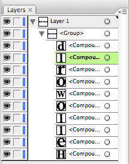
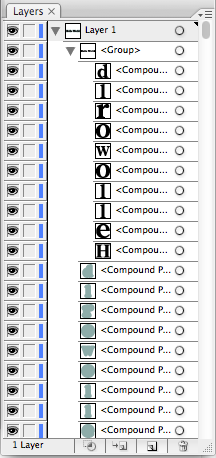
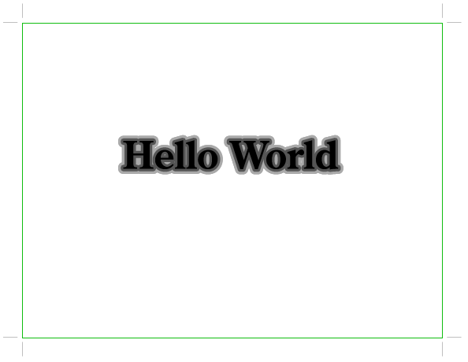
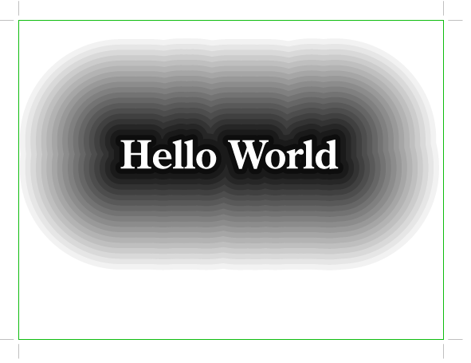

# Scripting Tutorial to Expanded Outlines

The final version of this script can be found here: [Expanded Outlines](https://github.com/ArtezGDA/illustratorPlugin-Examples/tree/master/expandedOutlines)

----

**Step 0: Start**  


### 1. Changed the font of the ExtendScript editor

The silly thing of the default **ExtendScript** editor font, is that it is not monospaced. Changing the font into a monospaced font will make reading the source code a lot easier

### 2. using `$.writeln()` to find the correct objects

```javascript
/* Expand Outlines - Multiple */

function duplicateOutline(obj, strokeW, color) {
}
function extraOutlines(objectGroup, strokeW, color) {
}
function buildOutlineStack(objectGroup) {
}

var doc = app.activeDocument;
var elements = doc.layers[0];
$.writeln (elements);
```

### 3. Study the different type of objects:

- documents
- layers
- groupItems
- compoundPaths
- pathItems
- ...

**Step 3.1: Investigate the layers**  


**Step 3.2: Printing the group(layer)**  

```diff
function duplicateOutline(obj, strokeW, color) {
function extraOutlines(objectGroup, strokeW, color) {
}
function buildOutlineStack(objectGroup) {
+		$.writeln (objectGroup);
+		var groups  = objectGroup.groupItems;
+		for (i = 0; i < groups.length; i++) {
+			$.writeln (groups[i]);
+		}
}
 
var doc = app.activeDocument;
var elements = doc.layers[0];
$.writeln (elements);
+buildOutlineStack(elements);
```

**Step 3.3: Adding strokes on all objects. Start of real work.**  

```diff
function buildOutlineStack(objectGroup) {
		var groups  = objectGroup.groupItems;
		for (i = 0; i < groups.length; i++) {
			$.writeln (groups[i]);
+			var group = groups[i];
+			
+			var compounds = group.compoundPathItems;
+			for (j = 0; j < compounds.length; j++) {
+				$.writeln(compounds[j]);
+				var compound = compounds[j];
+				
+				var paths = compound.pathItems;
+				$.writeln (paths.length);
+				for (k = 0; k < paths.length; k++) {
+					$.writeln(paths[k]);
+					var path = paths[k];
+					path.strokeColor = path.fillColor;
+					path.strokeWidth = 25.0;
+				}
+			}
		}
}
```

### 4. Study the creation of colors

**Step 4: Create grey outlines**  


**Step 4.1: adding greyish stroke. (Still is much easier done in Illustrator itself)**

```diff
/* Expand Outlines - Multiple */

-function duplicateOutline(obj, strokeW, color) {
+function duplicateOutline(compound, strokeW, color) {
+	var paths = compound.pathItems;
+	$.writeln (paths.length);
+	for (k = 0; k < paths.length; k++) {
+		$.writeln(paths[k]);
+		var path = paths[k];
+		path.strokeColor = color;
+		path.fillColor = color;
+		path.strokeWidth = strokeW;
+	}
}
function extraOutlines(objectGroup, strokeW, color) {
+	
+	var compounds = objectGroup.compoundPathItems;
+	for (j = 0; j < compounds.length; j++) {
+		$.writeln(compounds[j]);
+		var compoundObj = compounds[j];
+		
+		duplicateOutline(compoundObj, strokeW, color);
+	}
}
function buildOutlineStack(objectGroup) {
-		$.writeln (objectGroup);
-		var groups  = objectGroup.groupItems;
-		for (i = 0; i < groups.length; i++) {
-			$.writeln (groups[i]);
-			var group = groups[i];
-			
-			var compounds = group.compoundPathItems;
-			for (j = 0; j < compounds.length; j++) {
-				$.writeln(compounds[j]);
-				var compound = compounds[j];
-				
-				var paths = compound.pathItems;
-				$.writeln (paths.length);
-				for (k = 0; k < paths.length; k++) {
-					$.writeln(paths[k]);
-					var path = paths[k];
-					path.strokeColor = path.fillColor;
-					path.strokeWidth = 25.0;
-				}
-			}
-		}
+	$.writeln (objectGroup);
+	var groups  = objectGroup.groupItems;
+	for (i = 0; i < groups.length; i++) {
+		$.writeln (groups[i]);
+		var group = groups[i];
+		
+		var grey = new RGBColor();
+		grey.red = 144;
+		grey.green = 172;
+		grey.blue = 169;
+		extraOutlines(group, 20.0, grey);
+	}
}

var doc = app.activeDocument;
```

### 5. Study the setting of Stroke caps and joins

**Step 5: Add stroke cap and stroke join**

```diff
		var path = paths[k];
		path.strokeColor = color;
		path.fillColor = color;
+		path.strokeCap = StrokeCap.ROUNDENDCAP;
+		path.strokeJoin = StrokeJoin.ROUNDENDJOIN;
		path.strokeWidth = strokeW;
	}
}
```

### 6. Get bitten by the ***recursive duplication trap***

**Step 6: Getting bitten by the recursive duplication problem**

```diff
/* Expand Outlines - Multiple */

function duplicateOutline(compound, strokeW, color) {
-	var paths = compound.pathItems;
-	$.writeln (paths.length);
+	// Duplicate the compoundPath
+   var duplicate = compound.duplicate();
+	
+	// Find the paths of the new compoundPath
+	var paths = duplicate.pathItems;
+	// Stroke and color each path
	for (k = 0; k < paths.length; k++) {
-		$.writeln(paths[k]);
		var path = paths[k];
		path.strokeColor = color;
		path.fillColor = color;
```

### 7. Fix the recursive bug with extra count variable and place at end

**Step 7: Place the new elements at the end**  


**Step 7.1: Duplication works**  


**Step 7.2: Placing duplicates at the end**

```diff
function duplicateOutline(compound, strokeW, color) {
	// Duplicate the compoundPath
	var duplicate = compound.duplicate();
+	
+	// Send to back
+	duplicate.move(doc, ElementPlacement.PLACEATEND);
	
	// Find the paths of the new compoundPath
	var paths = duplicate.pathItems;
	// Stroke and color each path
@@ -20,8 +22,9 @@
function extraOutlines(objectGroup, strokeW, color) {
	
	var compounds = objectGroup.compoundPathItems;
-	for (j = 0; j < compounds.length; j++) {
-		$.writeln(compounds[j]);
+	var numberOfCompounds = compounds.length;
+	for (j = 0; j < numberOfCompounds; j++) {
+		$.writeln(compounds[j], compounds.length);
		var compoundObj = compounds[j];
		
		duplicateOutline(compoundObj, strokeW, color);
```

### 8. Improved place at end.

**Step 8: Improved place at end**

```diff
/* Expand Outlines - Multiple */

-function duplicateOutline(compound, strokeW, color) {
+function duplicateOutline(group, compound, strokeW, color) {
	// Duplicate the compoundPath
	var duplicate = compound.duplicate();
	
	// Send to back
-	duplicate.move(doc, ElementPlacement.PLACEATEND);
+	duplicate.move(group, ElementPlacement.PLACEATEND);
	
	// Find the paths of the new compoundPath
	var paths = duplicate.pathItems;
@@ -27,7 +27,7 @@ function extraOutlines(objectGroup, strokeW, color) {
		$.writeln(compounds[j], compounds.length);
		var compoundObj = compounds[j];
		
-		duplicateOutline(compoundObj, strokeW, color);
+		duplicateOutline(objectGroup, compoundObj, strokeW, color);
	}
}
function buildOutlineStack(objectGroup) {
```

### 9. Start simple

**Step 9: Start Simple**  


**Step 9: starting with simple extra outlines**

```diff
function extraOutlines(objectGroup, strokeW, color) {
	
+	// For each compound in the group, duplicate it
	var compounds = objectGroup.compoundPathItems;
-	var numberOfCompounds = compounds.length;
+	var numberOfCompounds = compounds.length; // Prevent recursive loop
	for (j = 0; j < numberOfCompounds; j++) {
		$.writeln(compounds[j], compounds.length);
		var compoundObj = compounds[j];
@@ -31,21 +32,50 @@ function extraOutlines(objectGroup, strokeW, color) {
	}
}
function buildOutlineStack(objectGroup) {
-	$.writeln (objectGroup);
	var groups  = objectGroup.groupItems;
	for (i = 0; i < groups.length; i++) {
		$.writeln (groups[i]);
		var group = groups[i];
+		var max_stroke = 30;
+		var stroke = 0;
+		stroke = 10
+		var grey = new RGBColor();
+		// Fade from black to white
+		grey.red = (stroke / max_stroke) * 255;
+		grey.green = (stroke / max_stroke) * 255;
+		grey.blue = (stroke / max_stroke) * 255;
+		extraOutlines(group, stroke, grey);
		
+		stroke = 20
		var grey = new RGBColor();
-		grey.red = 144;
-		grey.green = 172;
-		grey.blue = 169;
-		extraOutlines(group, 20.0, grey);
+		// Fade from black to white
+		grey.red = (stroke / max_stroke) * 255;
+		grey.green = (stroke / max_stroke) * 255;
+		grey.blue = (stroke / max_stroke) * 255;
+		extraOutlines(group, stroke, grey);
+		
+		/*
+		// Maximum stroke width and steps
+		var max_stroke = 500;
+		var stroke_step = 10;
+		
+		// Repeat the stroke duplicating
+		for (stroke = 0; stroke < max_stroke; stroke += stroke_step) {
+			
+			var grey = new RGBColor();
+			// Fade from black to white
+			grey.red = (stroke / max_stroke) * 255;
+			grey.green = (stroke / max_stroke) * 255;
+			grey.blue = (stroke / max_stroke) * 255;
+			extraOutlines(group, stroke, grey);
+			
+		}
+		*/
	}
}

+// Get the document
var doc = app.activeDocument;
var elements = doc.layers[0];
-$.writeln (elements);
+// build the stack of outlines on the 1st layer
buildOutlineStack(elements);
```

### 10. Fixed 2nd recursive bug (by using targetGroup)

**Step 10: Fixing second recursive bug by using targetGroup**

```diff
/* Expand Outlines - Multiple */

-function duplicateOutline(group, compound, strokeW, color) {
+function duplicateOutline(targetGroup, compound, strokeW, color) {
	// Duplicate the compoundPath
	var duplicate = compound.duplicate();
	
	// Send to back
-	duplicate.move(group, ElementPlacement.PLACEATEND);
+	duplicate.move(targetGroup, ElementPlacement.PLACEATEND);
	
	// Find the paths of the new compoundPath
	var paths = duplicate.pathItems;
@@ -19,7 +19,7 @@ function duplicateOutline(group, compound, strokeW, color) {
		path.strokeWidth = strokeW;
	}
}
-function extraOutlines(objectGroup, strokeW, color) {
+function extraOutlines(targetGroup, objectGroup, strokeW, color) {
	
	// For each compound in the group, duplicate it
	var compounds = objectGroup.compoundPathItems;
@@ -28,49 +28,28 @@ function extraOutlines(objectGroup, strokeW, color) {
		$.writeln(compounds[j], compounds.length);
		var compoundObj = compounds[j];
		
-		duplicateOutline(objectGroup, compoundObj, strokeW, color);
+		duplicateOutline(targetGroup, compoundObj, strokeW, color);
	}
}
function buildOutlineStack(objectGroup) {
	var groups  = objectGroup.groupItems;
-	for (i = 0; i < groups.length; i++) {
-		$.writeln (groups[i]);
-		var group = groups[i];
-		var max_stroke = 30;
-		var stroke = 0;
-		stroke = 10
-		var grey = new RGBColor();
-		// Fade from black to white
-		grey.red = (stroke / max_stroke) * 255;
-		grey.green = (stroke / max_stroke) * 255;
-		grey.blue = (stroke / max_stroke) * 255;
-		extraOutlines(group, stroke, grey);
+	var targetGroup = groups.add();
+	targetGroup.move(objectGroup, ElementPlacement.PLACEATEND);
+	var group = groups[0];
+	// Maximum stroke width and steps
+	var max_stroke = 400;
+	var stroke_step = 20;
+	
+	// Repeat the stroke duplicating
+	for (stroke = stroke_step; stroke < max_stroke; stroke += stroke_step) {
		
-		stroke = 20
+		$.writeln(stroke);
		var grey = new RGBColor();
		// Fade from black to white
		grey.red = (stroke / max_stroke) * 255;
		grey.green = (stroke / max_stroke) * 255;
		grey.blue = (stroke / max_stroke) * 255;
-		extraOutlines(group, stroke, grey);
-		
-		/*
-		// Maximum stroke width and steps
-		var max_stroke = 500;
-		var stroke_step = 10;
-		
-		// Repeat the stroke duplicating
-		for (stroke = 0; stroke < max_stroke; stroke += stroke_step) {
-			
-			var grey = new RGBColor();
-			// Fade from black to white
-			grey.red = (stroke / max_stroke) * 255;
-			grey.green = (stroke / max_stroke) * 255;
-			grey.blue = (stroke / max_stroke) * 255;
-			extraOutlines(group, stroke, grey);
-			
-		}
-		*/
+		extraOutlines(targetGroup, group, stroke, grey);
	}
}
```

**Step 11: Finished work**  


