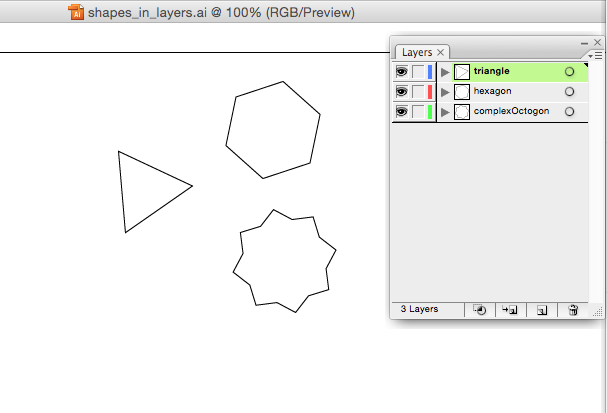

# Scripting Tutorial to Export Each Layer as SVG

The final version of this script can be found here: [Export Each Layer as SVG](https://github.com/ArtezGDA/illustratorPlugin-Examples/tree/master/exportEachLayer)

----

**Step 0: Start with Illustrator document with a few (named) layers**  


### 1. Start with a simple setup of logging the active document

```javascript
// Get the active document
if ( app.documents.length > 0 ) {
	var doc = app.activeDocument;

    // Display a dialog to the user
    alert(doc);
    
    // Log to the ExtendScript ToolKit Javascript Console
    $.writeln(doc);
}
```

### 2. Get the layers and log them

```javascript
	// Get the layers
	if (doc.layers.length > 0) {
	var layers = doc.layers;
		
		// Print all layers
		for (var i = 0; i < layers.length; i++) {
			
			// Print the counter i, and the layer
            $.writeln(i);
			$.writeln(layers[i]);
		}
	}
```

### 3. Log the name of the layer

```javascript
			// Print the name of the layer
			var theLayer = layers[i];
			$.writeln(theLayer.name);
```

### 4. Study how to create a new document

Read the code under the heading "**Duplicating the active document**" in Adobe's Javascript Reference.

### 5. Study the properties and functions of a layer

Read the section about the **pageItems** property of a **Layer**, under **Layer properties**.

### 6. Copy each layer into its own document

```javascript
			// Create a new document
			var newDoc = app.documents.add();
			
			// Get all the page items
			var pageItems = theLayer.pageItems;
			
			if (pageItems.length > 0) {
				
				for (var j = 0; j < pageItems.length; j++) {
					
					// Copy every page item into that new document
					var pageItem = pageItems[j];
					var newItem = pageItem.duplicate(newDoc, ElementPlacement.PLACEATEND);
				}
			}
```

### 7. Study how to export SVG files

Read the code under the heading "**Exporting to SVG format**" in Adobe's Javascript Reference.

### 8. Print the path of the current file and format a new path name

```javascript
			// Print the path of the Illustrator document
			
			var docPath = doc.path;
			svgFilePath = docPath + "/hello.svg";
			
			$.writeln(docPath);
			$.writeln(svgFilePath);
```

```javascript
			// Create a new name for the svg file to export
			var docPath = doc.path;
			svgFilePath = docPath + "/" + theLayer.name + ".svg";
			
			$.writeln(svgFilePath);
```

### 9. Export the new document as SVG

```javascript
			// Export the new document as SVG
			var exportOptions = new ExportOptionsSVG();
			var type = ExportType.SVG;
			var fileSpec = new File(svgFilePath);
			exportOptions.embedRasterImages = true;
			exportOptions.embedAllFonts = false;
			exportOptions.fontSubsetting = SVGFontSubsetting.GLYPHSUSED;
			newDoc.exportFile( fileSpec, type, exportOptions );
```
